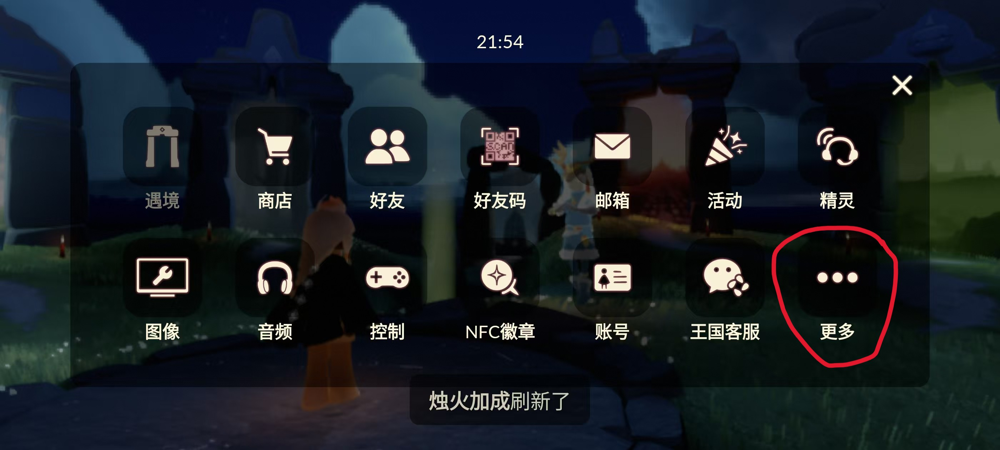
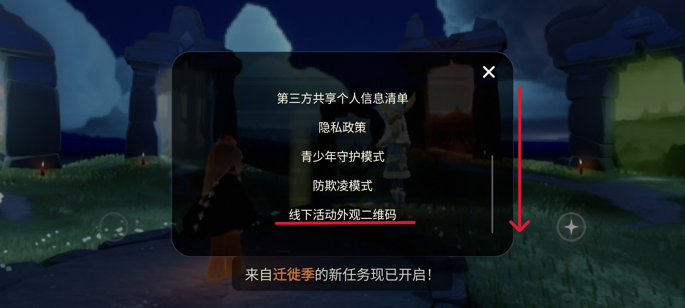

# Sky 光遇身高计算器 ⛰️

一个纯前端的光遇线下活动二维码解析工具，用于提取身高数据并计算游戏内实际身高。


## ✨ 特性

- 🎨 **精美 Sky 主题** - 渐变星空背景、浮动云朵、闪烁星星
- 📱 **纯前端实现** - 无需服务器，本地即可运行
- 🔍 **多格式支持** - 自动识别三种 QR 编码格式
  - 标准 JSON 格式
  - Protobuf 压缩格式
  - JSON + 控制符格式
- 📤 **多种上传方式** - 支持拖拽、点击上传、摄像头拍摄
- ⚡ **智能解析** - 自动清理 Base64、多次尝试识别
- 💫 **流畅动画** - 加载动画、模态框淡入淡出

## 🚀 快速开始

### 在线使用

直接打开 `index.html` 即可使用，无需安装任何依赖。

### 本地运行

```bash
# 克隆仓库
git clone https://github.com/oivio-up/Sky-QR-For-Height.git

# 进入目录
cd Sky-QR-For-Height

# 直接打开 index.html（双击或用浏览器打开）
# 或者使用本地服务器
python -m http.server 8000
# 访问 http://localhost:8000
```

## 📖 使用教程

### 1. 获取二维码-1
在游戏中，前往 **设置 > 更多**



### 2. 获取二维码-2
向下拉，找到线下活动外观二维码



### 3. 上传或输入
您可以直接**上传截图**，或使用扫码工具读取截图，得到以 `https://sky.thatg.co/o=` 开头的网址后，**复制整个网址**并贴到输入框。

### 4. 查看结果
点击「开始计算」按钮，系统会自动识别并计算出您的当前身高、最高身高和最低身高。

### 5. 历史记录
所有计算结果会自动储存到历史记录中，点击「历史记录」按钮可查看所有记录，还可以查看身高变化趋势图。

### 6. 部分问题
由于解码问题，有时并不能获得完整的height值和scale值，导致计算结果会有点数据偏移。该工具仅供参考，该工具纯前端运行，不会上传任何数据，请放心使用。

### 身高计算公式
```
当前身高 = 7.6 - 8.3 × scale - 3 × height
```

## 🐛 故障排除

### QR 码无法识别
- 确保图片清晰，二维码完整
- 尝试调整图片亮度和对比度
- 避免二维码变形或遮挡

### 解析失败
- 检查是否为光遇线下活动二维码
- 某些特殊格式可能不支持

## 💡 原理说明

### 编码格式检测
1. 清理 Base64 字符串（移除非标准字符）
2. 尝试 Protobuf 格式解析（检测 `0x15` 标记）
3. 回退到 JSON 正则表达式匹配
4. 多次尝试不同对比度和灰度处理

### 身高计算
基于光遇游戏内部公式:
- 基准高度: 7.6 头身
- Scale 影响: -8.3 倍系数
- Height 影响: -3 倍系数

---

